 Руководство пользователя
---

# Работа с тестами

В данном руководстве будут описываться шаги по правильному циклу работ с тестами от самого начала до конца с помощью программ  **Mlab** и **MlabScanner**. Общая последовательность действий следующая:

1. Создаем сет для тестирования
2. Создаем группу антибиотиков для тестирования
3. Создаем тест
4. Генерируем штрих-коды для планшетов
5. Проводим тестирование
5. Сканируем планшеты
6. Валидируем результаты
7. Дальнейшая работа с результатами

[TOC]

## Создаем сет для тестирования

Чтобы открыть **Конструктор сетов** необходимо на главном окне **Mlab** нажать кнопку *Сеты*. 

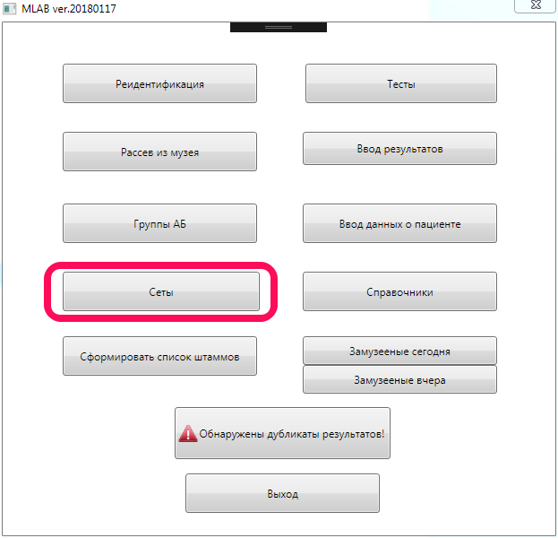

Откроектся окно конструктора. В окне можно задать условия для поиска уже созданных сетов. Это рекомендуется сделать перед тем как создавать новый.

>**Примечание**: По умолчанию при открытии **Конструктора сетов** сеты созданные за последний месяц (около 30 дней).

Для просмотра содержимого существующих тестов выберите его в строчке и появится таблица со списком штаммов в данном сете.

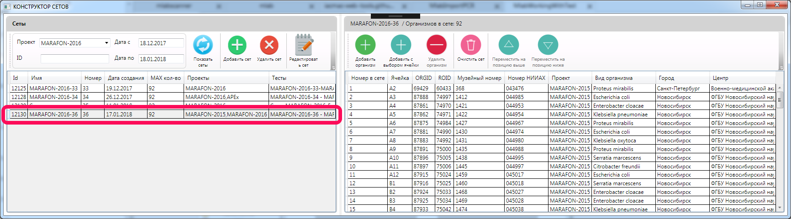

Допустим мы хотим создать новый сет в проекте *MARAFON-2016*. Для этого мы выбираем в выпадающем списке *Проект* MARAFON-2016 и нажимаем кнопку **Показать сеты**. Будьте готовы, что могут быть показаны сеты не только проекта MARAFON-2016, но и например MARAFON-2015, поскольку теперь сет может содержать в себе штаммы из нескольких проектов.

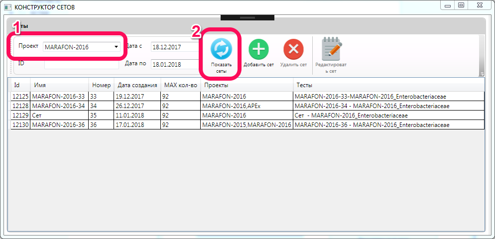

Это необходимо сделать, чтобы узнать, какой последний номер сета был в рамках данного проекта. Кроме того, имя нового сета, который мы создадим будет зависеть от выбранного значения в выпадающем списке *Проект*.

После того, как мы определились, какой номер будет иметь новый сет - можем нажать на кнопку **Добавить сет**

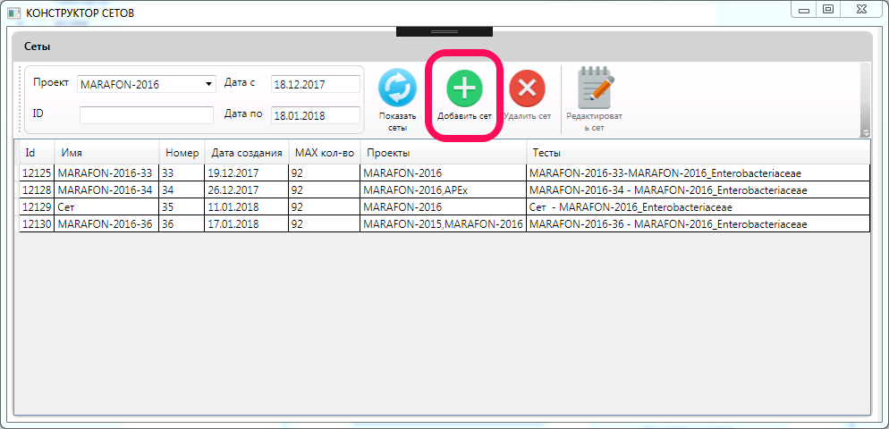

Появится окно добавления сета.

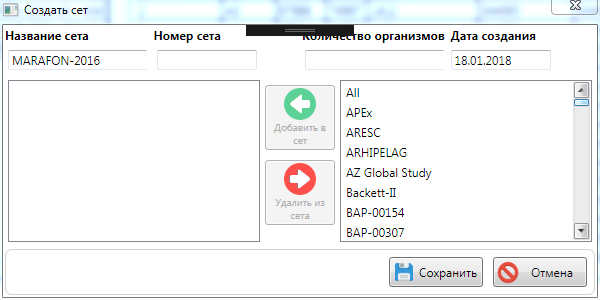

В нем уже заполнено поле **Название сета** и **Дата создания**. При желании содержимое этих полей можно изменить. Нам необходимо ввести **Номер сета** (пусть он будет, например 37) и **Количество организмов** (например 92). После этого необходимо выбрать проекты, в которых будет участвовать сет. Выбранные проекты, будут определять - штаммы из каких проектов можно будет добавить в новый сет. Например, если мы добавим проекты MARAFON-2015 и MARAFON-2016, то при добавлении организмов из рассева нам будут доступны как организмы, участвующие в проектах MARAFON-2016, так и организмы, участвующие в MARAFON-2015.

После заполнения всех полей окно будет выглядеть примерно так.

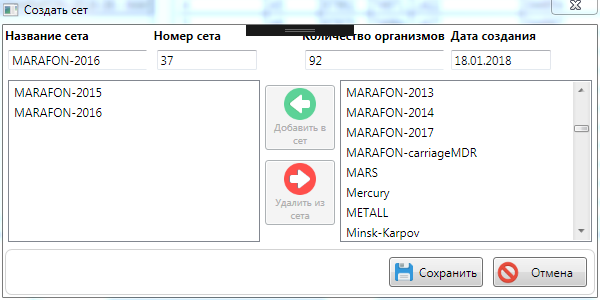

Нажимаем кнопку **Сохранить** и переходим к добавлению организмов в сет.

>**Примечание**: Вы можете внести измения в сет с помощью кнопки **Редактировать сет** до тех пор, пока он не назначен какому-либо тесту.
>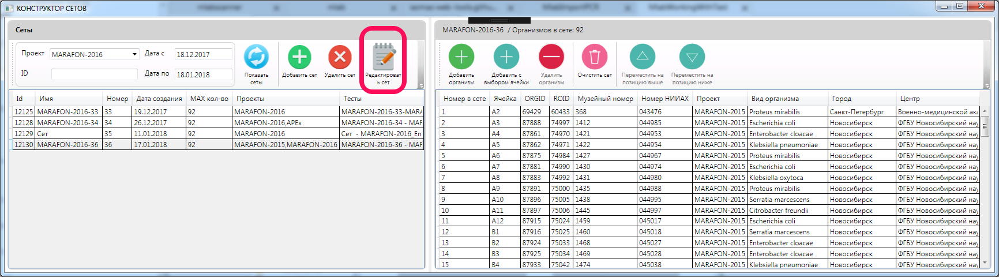

Для добавления организмов в сет нажмите кнопку **Добавить организм**. В появившемся окне будут показаны все штаммы из рассева, которые участвуют в проектах, которые вы указали при создании сета. Кликами мышкой с зажатыми клавишами *Shift* или *Ctrl* выберите необходимые штаммы, сколько выбрано будет показываться в нижней части окна. После завершения, нажмите **Применить** и они добавятся в сет. Позиции ячеек будут назначены автоматически, при желании их можно будет изменить с помощью кнопок.

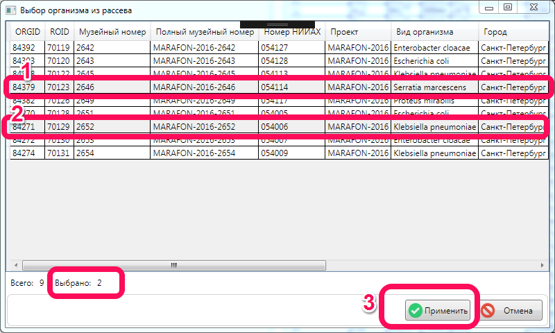

Если какие либо штаммы были добавлены ошибочно, их можно удалить по одному с помощью кнопки **Удалить организм**. После удаления штаммы не назначаются на новые позиции, поэтому остаются пропуски. Чтобы это исправить - используйте кнопки **Переместить на позицию вверх** и **Переместить на позицию вниз**. Присутствует возможность полностью очистить сет, вернув его в первозданное состояние (кнопка **Очистить сет**).

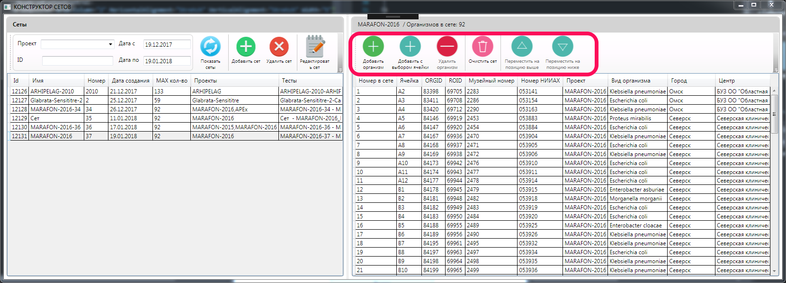

>**Примечание**: Помните, что удалять штаммы из сета, очищать и удалять сет вовсе можно только в том случае, если для штамма еще не были получены его результаты. После удаления штаммов из сета, организмы автоматически попадают обратно в рассев.

После того, как все нужные штаммы добавлены в сет, можно переходить к созданию группы антибиотиков для данного сета.

## Создаем группу антибиотиков для тестирования

Для работы с группами антибиотиков на стартовом окне **Mlab** нажмите кнопку **Группы АБ**. Здесь можно увидеть все группы, которые когда либо были созданы в системе.

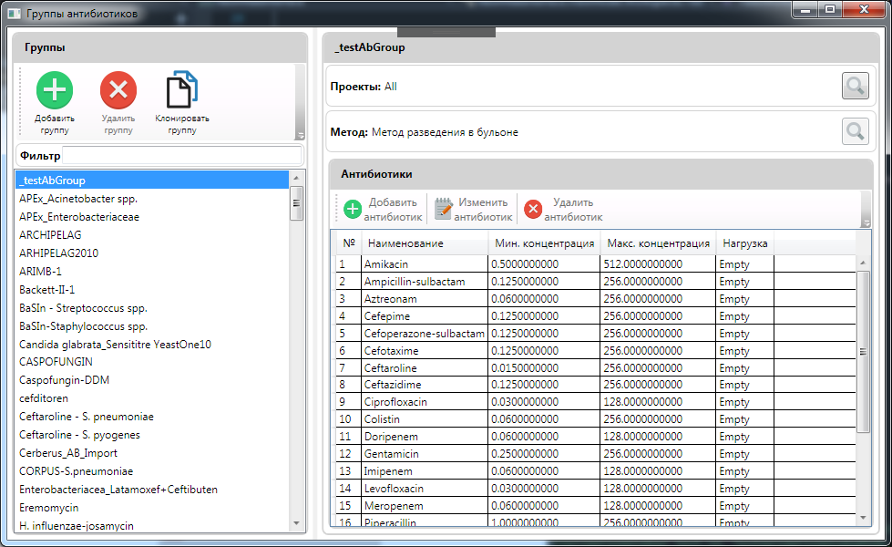

Для добавления новой нажмите кнопку **Добавить группу**.

В появившемся окне введите название группы и метод тестирования. Обычно группа назвается по имени проекта в котором она используется и группе микроорганизмов к которой относится. После заполнения названия и метода тестирования нажмите кнопку **Сохранить**.

Если уже у вас уже есть группа, которая практически вам подходит и нуждается лишь в небольших исправлениях - нажмите кнопку **Клонировать группу**. Это позволит полностью скопировать существующую группу антибиотиков и изменить ее.

Для вновь созданной группы нужно установить проекты, в которых она будет участвовать. Это нужно, чтобы при создании тестов показывались только те группы, которые доступны для проектов теста.

>**Примечание**: Проекты, в которых участвует группа антибиотиков можно добавлять и для групп, которые уже назначены тестам и для антибиотиков из группы уже получены результаты.

Теперь нужно добавить антибиотики.

>**Примечание**: Редактировать состав антибиотиков в группе можно только если для антибиотиков из этой группы еще нет результатов тестирования. Состав проектов, в которых может участвовать данная группа можно изменять в любой момент.

Нажимаем кнопку **Добавить антибиотик** и в появившемся окне выбираем антибиотик, выставляем минимальную и максимальную концентрацию. Это потребуется в дальнейшем для проверки валидности результатов.

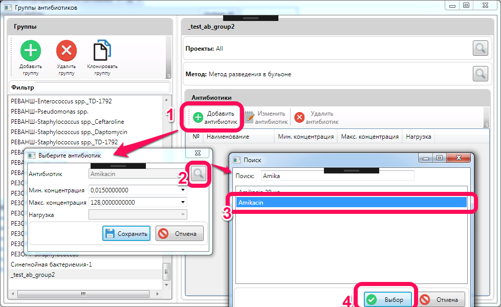

После того, как все антибиотики добавлены в группу, необходимо сгенерировать штрих-коды для антибиотиков. даже если не планируется клеить штрих-коды на планшеты, это все равно необходимо сделать. Без штрих-кодов антибиотиков нельзя будет сканировать результаты с планшетов. 

Для этого нажимаем на кнопку **Штрихкоды** и в появившемся окне нажимаем кнопку **Сгенерировать штрихкоды**.

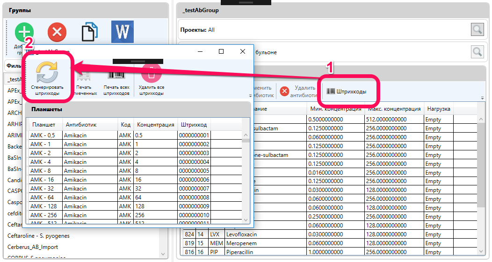

После этого можно переходить к созданию теста.

## Создаем тест

Чтобы открыть **Конструктор тестов** необходимо на главном окне **Mlab** нажать кнопку *Тесты*. Структура окна похожа на **Конструктор сетов** - в нем так же отображаются тесты за последний месяц и присутствует фильтр, благодаря которому можно искать интересующие вас тесты. При выборе теста из списка в правой части отображается подробная информация о нем.

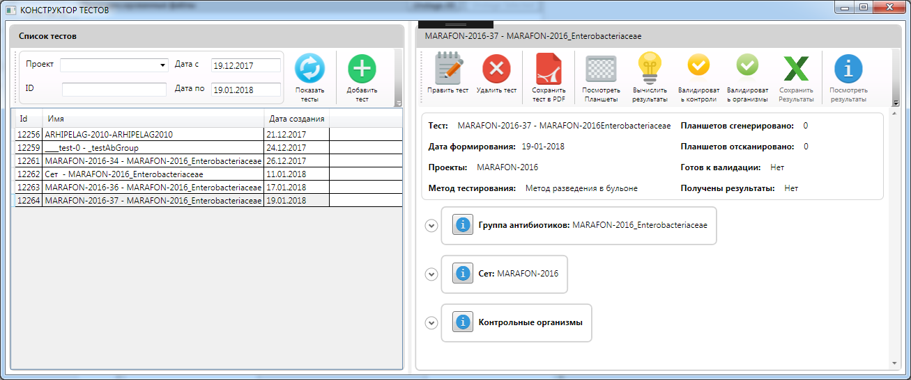

>**Примечание**: Для понимания: Тест - это совокупость Сета, Группы Антибиотиков и Контрольных штаммов. 

Чтобы создать новый тест - нажмите кнопку **Добавить тест**.

Прежде всего нужно задать, к каким проектам будет относится тест. Это определит набор сетов и групп антибиотиков, доступных для добавления. После этого выбираем *Сет* и *Группу Антибиотиков*. При необходимости можно добавить контрольные штаммы, но помните, что обязательно им нужно назначить ячейки, в которых они должны быть расположены.

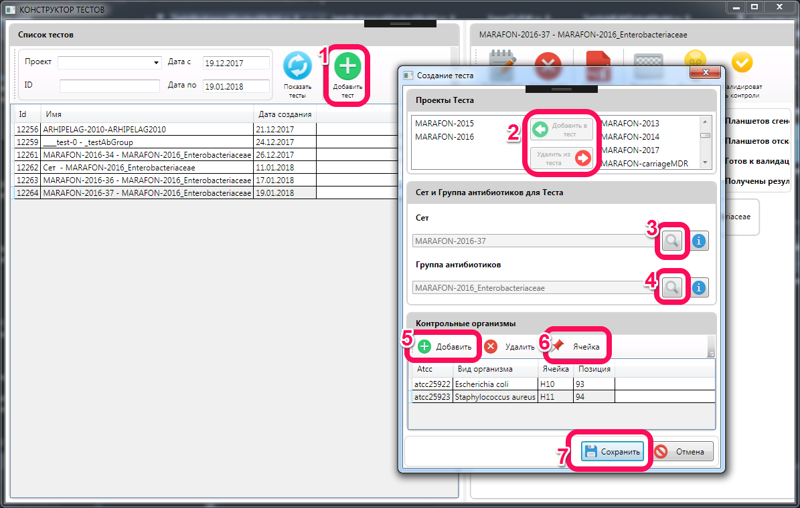

Для сохранения нового теста нажмите **Сохранить**.

После создания теста, в правой части экрана можно еще раз проверить - всё ли сделано правильно: все ли штаммы включены в тестирование для всех требуемых антибиотиков. При желании можно открыть показываемые таблицы и скопировать их в Excel.

>**Примечание**: Изменить или Удалить созданный тест можно только если для теста еще не сгенерированы планшеты и не получены результаты.

Если все сделано правильно, можно переходить к генерации планшетов.

## Генерация планшетов

После создания теста необходимо сгенерировать планшеты для тестирования и распечатать для них штрих коды. Для этого нажмем кнопку **Посмотреть планшеты**.

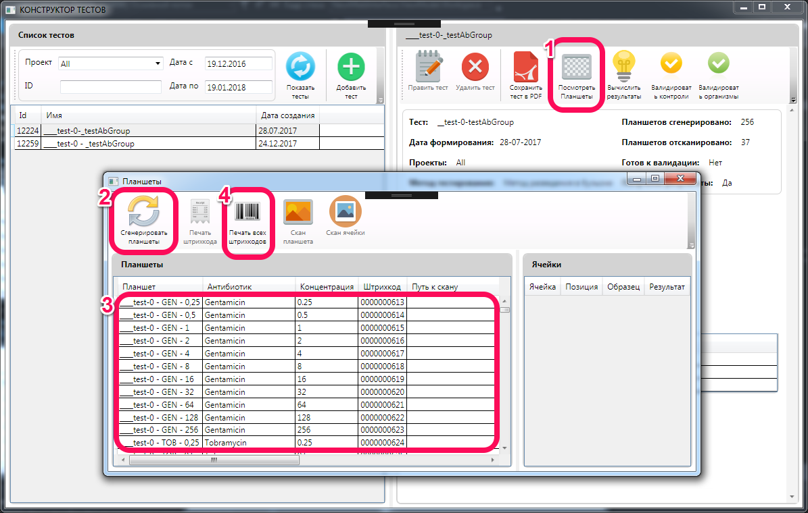

В открывшемся окне нажимаем кнопку **Сгенерировать планшеты**. Дожидаемся окончания процесса. После завершения таблицы заполнятся строками и все готово к печати. Проверьте, включен ли принтер **Zebra GX430t** и нажмите кнопку **Печать всех штрих кодов**. При необходимости можно распечатать и отдельный штрих код с помощью кнопки **Печать штрихкода**.

Сам штрих-код выглядит следующим образом:

Его необходимо наклеить на торец планшета, противоположного ячейке А1 как показано на рисунке.

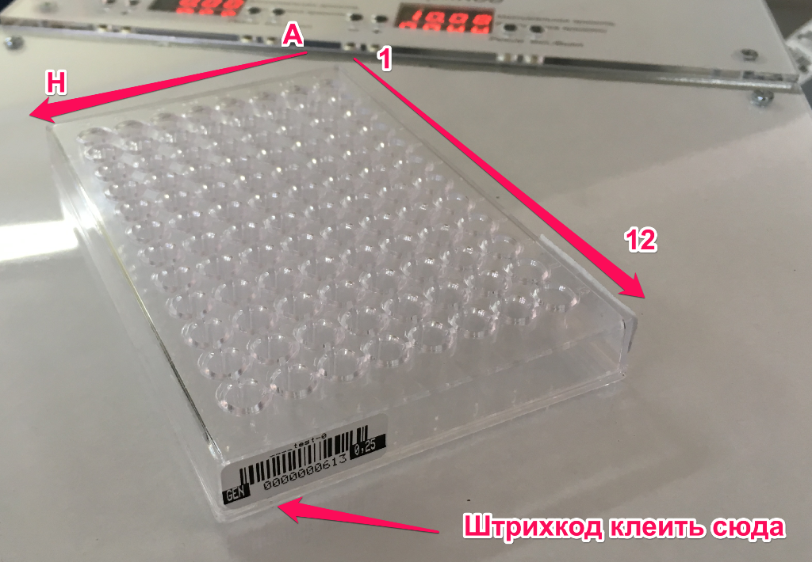

## Сканируем планшеты

>**==ВНИМАНИЕ! Включать прибор только с ОТКРЫТОЙ дверцей, иначе сканер не заработает! Потом дверцу можно закрыть!==**

- Включаем прибор в розетку, проверяем - загорелись ли индикаторы
- Включаем подсветку на панели
- Открываем дверцу
- Подключаем оба USB-шнура к компьютеру.
- Закрываем дверцу
- После этого запускаем программу **MlabScanner**.

При запуске программа проверяет, подключен ли прибор и в случае, если ей не удается активировать камеру выдает сообщение об ошибке.

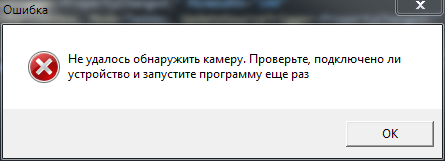

Программа запустится, но работать с ней нельзя. В этом случае нужно закрыть окно программы, еще раз проверить, включен ли прибор в розетку, подключены ли ОБА USB-шнура к компьютеру и уже после этого звонить кому-то.

Если все нашлось и программа запустилась - откроется такое окно и можно начинать сканирование.

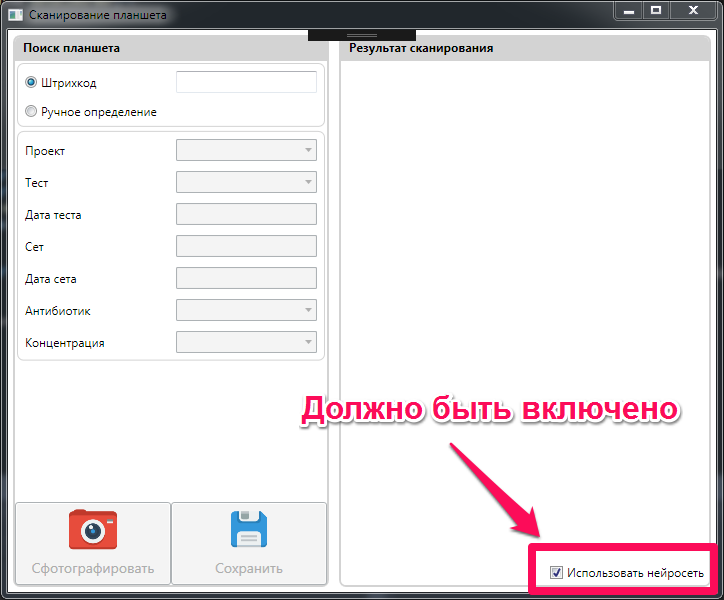

>**Примечание**: Проверьте, что в правом нижнем угле отмечаен пункт **Использовать нейросеть**. В противном случае определение *Есть рост/Нет роста* работать не будет.

### Сканирование в автоматическом режиме

Сканирование возможно в автоматическом и ручном режиме. По умолчанию включен автоматический режим - сопоставление планшета с информацией в базе данных происходит посредством сканирования штрих-кода. Перед каждым сканированием просим убедиться, что курсор ввода стоит в поле **Штрих-код**.

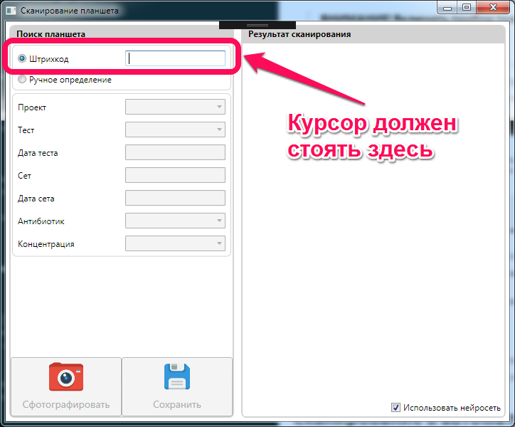

Устанавливаем планшет в прибор следующим образом:

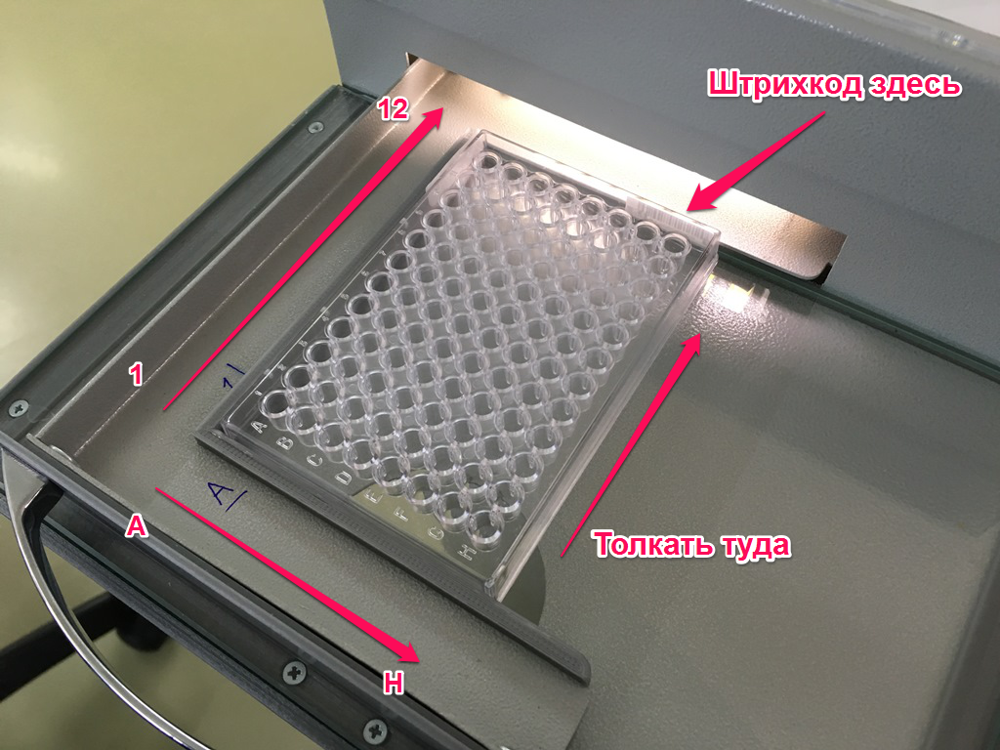

Задвигаем крышку до конца, когда штрих-код считается, раздастся писк, в поле штрих-код появится идентификатор планшета, поля автоматически заполнятся значениями из базы данных и если все определено правильно - планшет сфотографируется автоматически.

>**Примечание**: Если по каким-либо причинам штрих-код не считался - вы можете ввести его вручную.

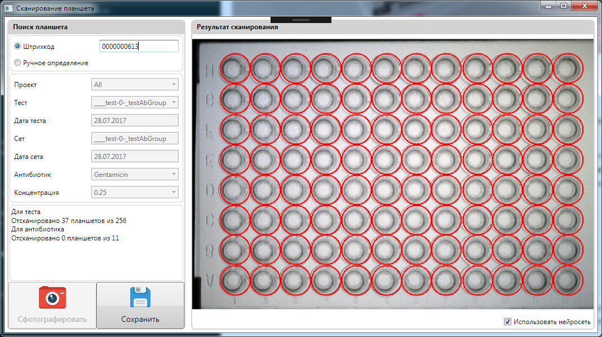

После этого должно появиться изображение планшета с цветными кругами - зеленый означает, что рост есть, красный - роста нет. В данном случае делать ничего не требуется, это сделано для контроля, что камера работает, подсветка включена, система работает. Если вы видите такую картинку, значит все прошло хорошо - нажмите кнопку **Сохранить**.

В ходе работы будет отображаться информация о том, сколько всего планшетов осталось отсканировать для теста и сколько для каждого антибиотика.

Если планшет уже сканировали, появится предупреждающее сообщение.

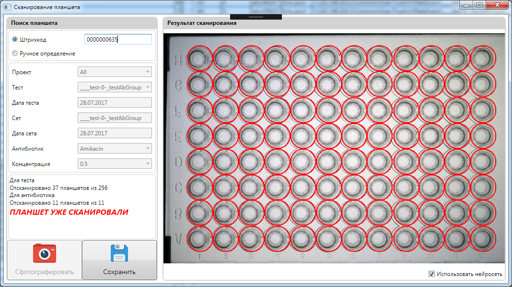

Оно ни к чему не обязывает, это еще один сигнал для проверки - действительно ли сканируемый планшет тот чем он является. Имейте в виду, что повторное сканирование перезапишет результаты предыдущего сканирования.

==Не забывайте нажимать кнопку **Сохранить** чтобы записать результаты распознавания в базу!==

### Сканирование в ручном режиме

Режим ручного сканирования предназначен для случаев, когда автоматически штрих-код не считывается или вовсе отсутствует.

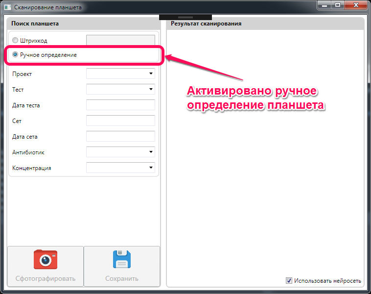

В этом случае вы последовательно выбираете из выпадающих списков необходимые пункты направляясь от проекта к концентрации сверху вниз. После установки концентрации обновится статусная информация и станет доступна кнопка **Сфотографировать**. Установите планшет в прибор и нажмите ее.

==Не забывайте нажимать кнопку **Сохранить** чтобы записать результаты распознавания в базу!==

После того, как все планшеты отсканированы - закрываем программу **MlabScanner**.

## Валидируем результаты

После того, как все планшеты отсканированы необходимо провалидировать полученные результаты. Данный процесс состоит из трех этапов:
1. Вычисление численных результатов МПК
2. Валидация контролей
3. Валидация организмов

>**Примечание**: Вы можете посмотреть снимки каждого из планшетов нажав кнопку **Посмотреть планшеты**
>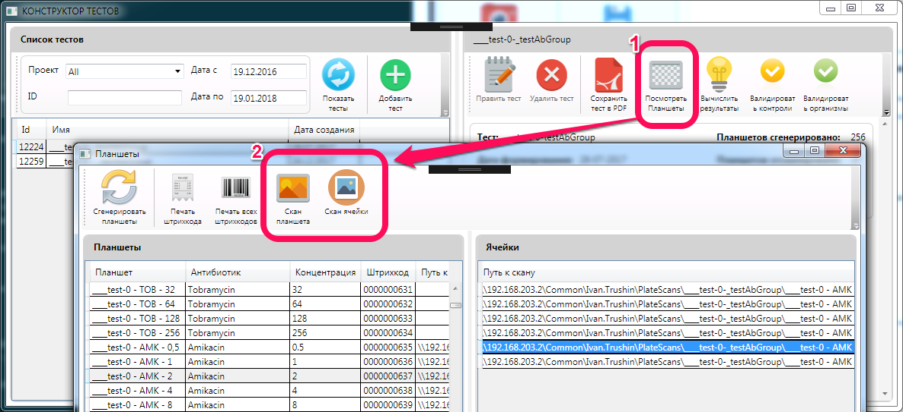

### Вычисление численных результатов МПК

Для этого находим тест, подвергшийся сканированию в **Конструкторе тестов**. Если цифры в пунктах **Планшетов сгенерировано** и **Планшетов отсканировано** совпадает, а пункт **Получены результаты** установлен в значение *Нет* - значит сканирование завершено и вычисление МПК по сканам не производилось. Нажимаем кнопку **Вычислить результаты**.

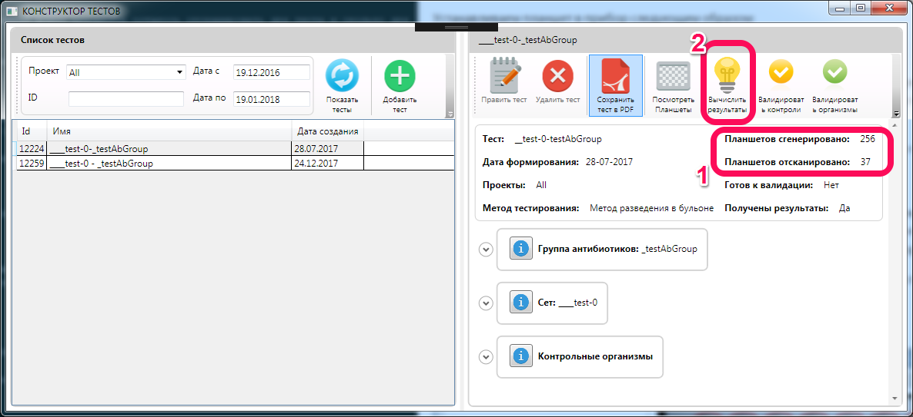

Дожидаемся окончания процесса. После завершения значения МПК получены, однако все они отмечены как неактивные и невалидные. Чтобы они зафиксировались как финальные и постоянные, необходимо пройти этапы валидации.

### Валидация контролей

Валидацию результатов необходимо начинать с валидации контролей, так как ее результаты напрямую влияют на результаты.
Чтобы начать - нажмите кнопку **Валидировать контроли**.

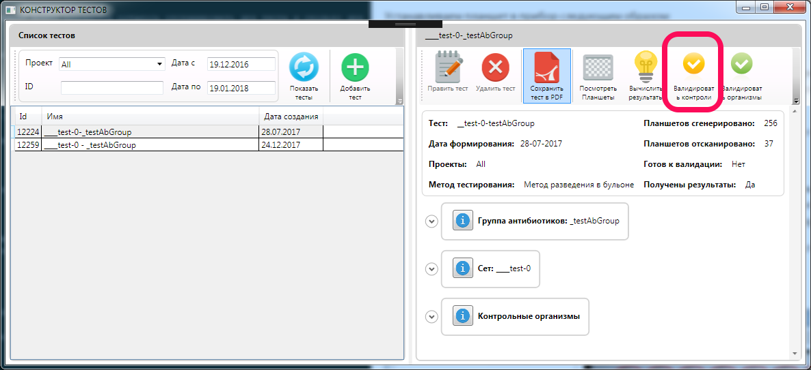

Появится окно Валидации планшетов контролей.

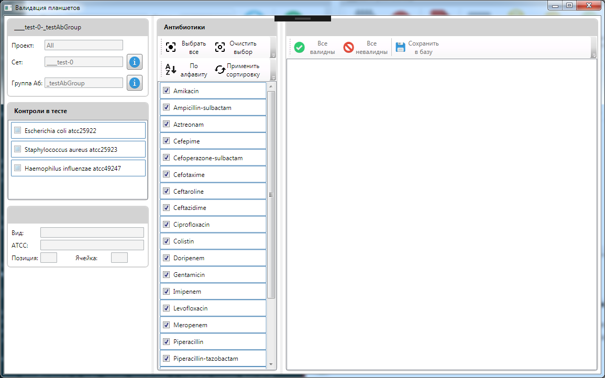

Вверху слева показана информация по тесту, в рамках которого производилось тестирование. Ниже - список всех контролей, участвовавших в тесте. По нажатии на один из них, справа появятся ячейки планшетов, соответствующие различным концентрациям антибиотиков. Если контроль нуждается в валидации (хотя бы один антибиотик непроверен - у него отсутствует галочка). Если у контроля стоит галочка - значит у него не осталось непроверенных антибиотиков.
Подробная информация о выбранном контроле и его позиция в планшете показывается ниже списка **Контроли в тесте**.

>**Примечание**: Возможно загрузка изображений ячеек займет некоторое время - это зависит от количества антибиотиков.

>**Примечание**: Вы можете определить порядок показа антибиотиков и даже скрыть некоторые с помощью панели фильтров антибиотиков. Элементы списка можно перетаскивать мышкой. Однако помните, что все равно нужно валидировать все результаты.
>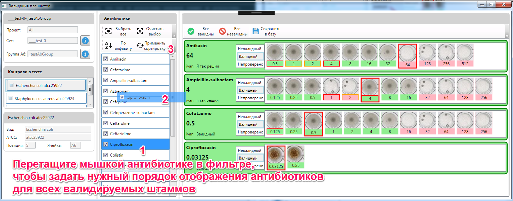
>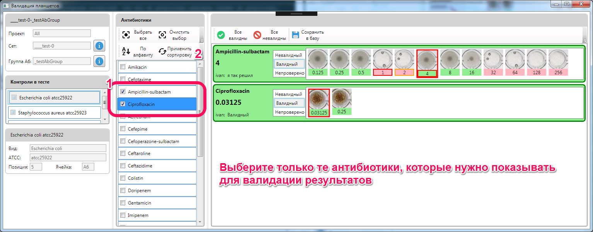
>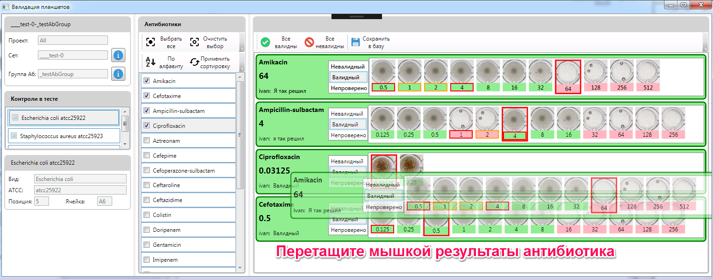
>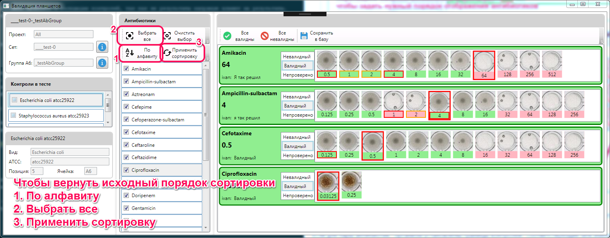

По умолчанию все строки серого цвета, что соответствует статусу **Непроверено**.
Под каждым антибиотиков написано вычисленное значение МПК, дополнительно ячейка с этим МПК обведена жирной красной рамкой.

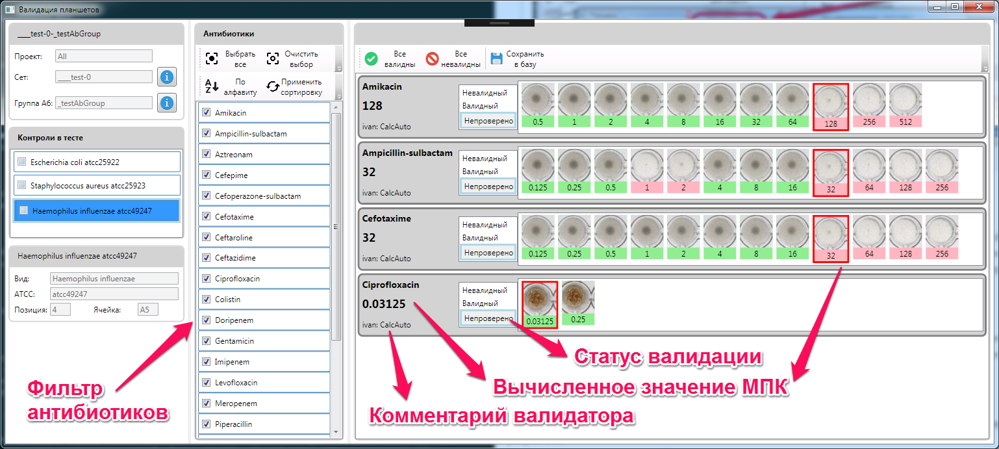

Если для пары антибиотик - организм установлены границы контролей - соответствующие мпк имеют оранжевую обводку для *Target* и красную обводку для *Range*. По умолчанию, если вычисленное МПК уходит за границы Range - результат помечается как невалидный.

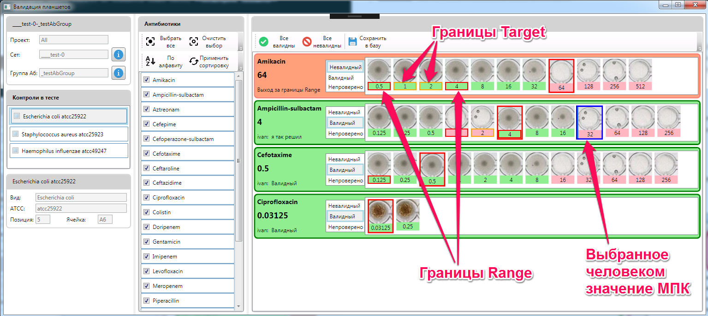

Задача валидатора - проверить, правильно ли сработала нейросеть и все МПК определены верно. Если же где то закралась ошибка, валидатор должен кликнуть на верное значение МПК (выбранная ячейка обведется синим) и во всплывающем по правому клику меню выбрать пункт **Изменить МПК**. Красная рамка должна переместиться на выбранную ячейку.

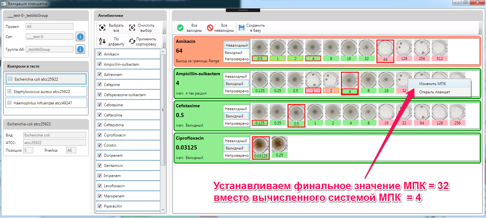

При желании валидатор может открыть полное изображение планшета, откуда была вырезана ячейка с помощью правого клика по ячейке и выбора пункта **Открыть планшет**.

После того, как все МПК были изменены, валидатор должен пометить каждый антибиотик *Валидным* или *Невалидным*, чтобы не осталось серых строк. Для этого для каждого антибиотика выбирается пункт из перечисления. Если необходимо пометить весь массив антибиотиков одним статусом - для этого служат кнопки в верхней части панели.

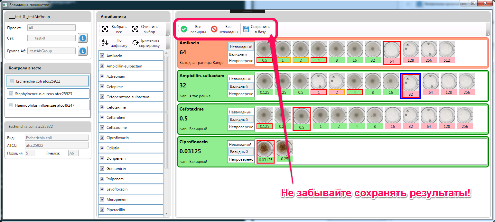

>**Примечание**: Если вы помечаете результат невалидным, программа предложит вам ввести комментарий, почему вы так решили.
>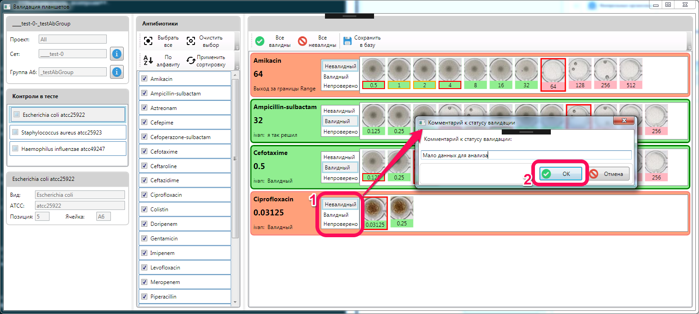

>**Примечание**: Если пометить контроль невалидным, автоматически невалидными помечаются и все результаты штаммов для данного антибиотика.

После того, как вы сделали все что хотели с выбранным контролем - нажмите кнопку **Сохранить в базу**, чтобы применить все сделанные вами изменения и перейти к следующему контролю.

Когда все контроли были просмотрены и провалидированы можно закрыть окно и переходить к валидации организмов.

Вкратце процесс - что нужно сделать показан ниже:

### Валидация организмов

Чтобы начать - для выбранного теста нажмите кнопку **Валидировать организмы**.

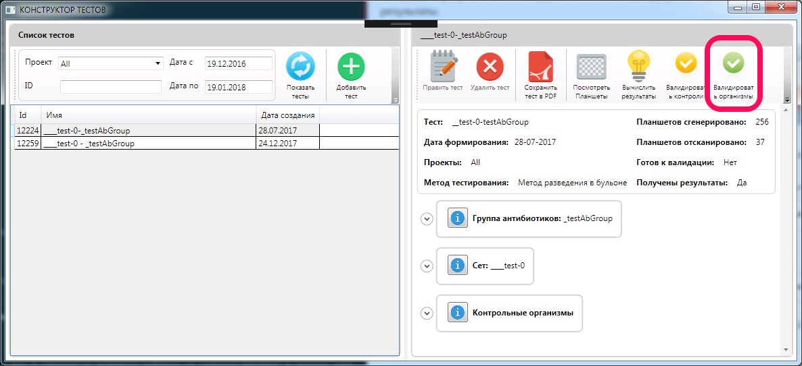

В целом процесс валидации совпадает с тем, что происходило в валидации контролей.

Разница состоит в том, что в начале не все результаты будут серы - некоторые могут быть красными  - они помечены невалидными вследствие невалидного результата контроля, о чем будет отображаться соответствующий комментарий.

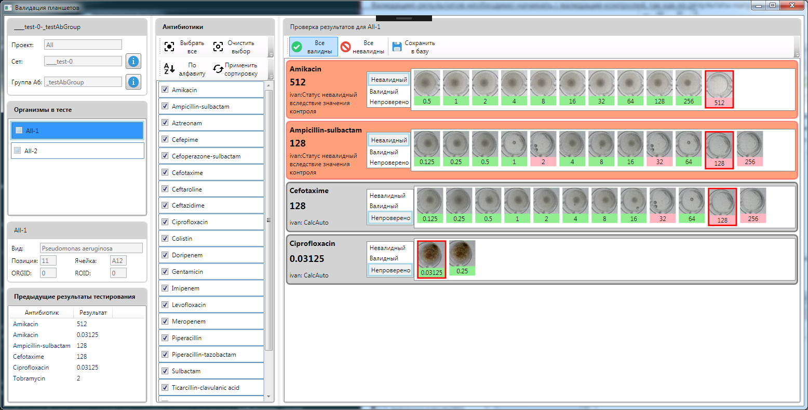

>**Примечание:** в подробной информации о штамме вы также можете видеть его *ORGID* и *ROID*, а еще ниже - предыдущие результаты тестирования данного штамма антибиотиками. Кроме того, если вы определяете результаты невалидными, это никак не влияет на статус валидности результатов контролей.

В остальном последовательность действий и логика процесса полностью совпадает с валидацией контролей.
Для повторения посмотрим еще одну анимацию.

## Дальнейшая работа с результатами

Чтобы увидеть результаты теста после валидации существует три кнопки:
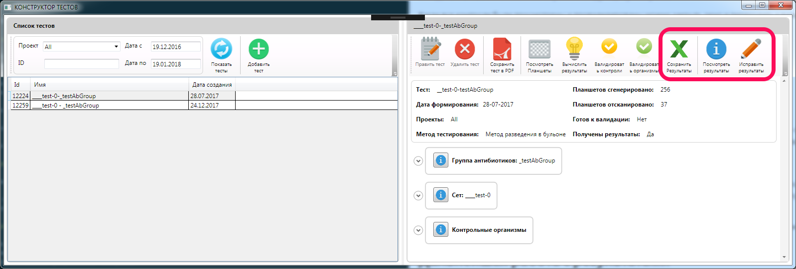

### Сохранение результатов

### Просмотр результатов
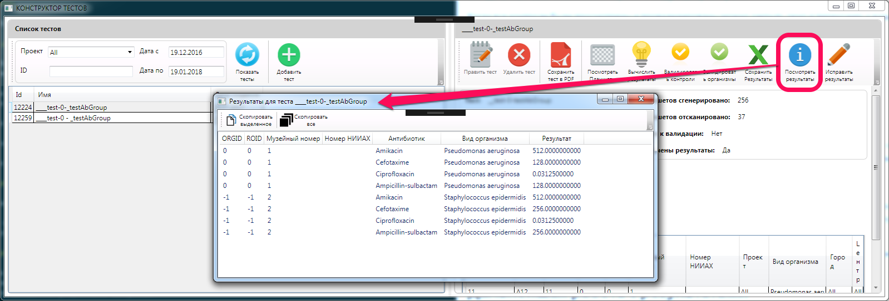

### Редактирование результатов
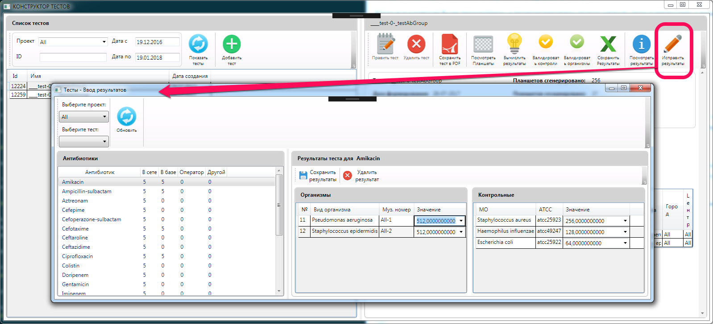

